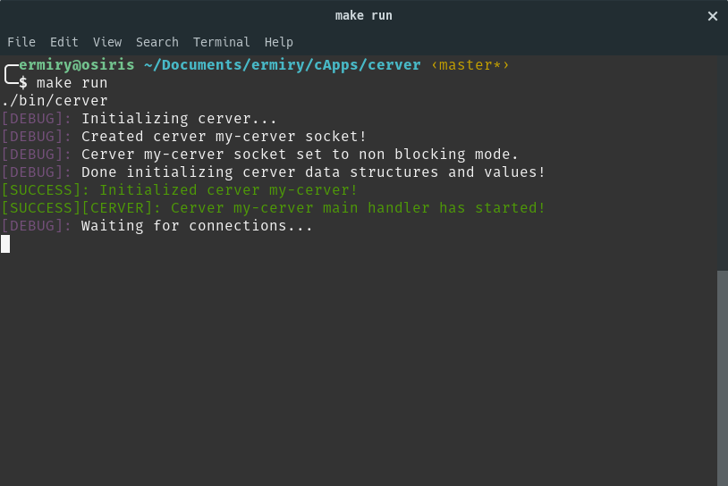

# Get Started

## 1. Install Dependencies

Your first need to install some dependencies to correctly compile **cerver** source code.

### Pthreads

If the pthreads library is not installed on your system, install it (in Ubuntu) by running:

`sudo apt-get install libpthread-stubs0-dev`

### libmongoc

You can install libmongoc, from the official site, with the base configuration, by running the following commands in Ubuntu:

`sudo apt-get update && sudo apt-get install -y cmake wget`

`wget https://github.com/mongodb/mongo-c-driver/releases/download/1.15.1/mongo-c-driver-1.15.1.tar.gz`
`tar xzf mongo-c-driver-1.15.1.tar.gz`

`cd mongo-c-driver-1.15.1`
`mkdir cmake-build`
`cd cmake-build`
`cmake -D ENABLE_AUTOMATIC_INIT_AND_CLEANUP=OFF -D CMAKE_BUILD_TYPE=Release ..`
`sudo make -j4 && sudo make install && sudo ldconfig`

## 2. Download Cerver Source Code

You can donwload **cerver's** latest source from this repo. If you want the latest rolling release in master, you can git clone in the master branch. However if you want the latest stable version, please refer to the releases tab in this repo and select the version you want.

## 3. Get Welcome Example Running

Now that you have **cerver's** source code, you can try running the base example.

Let's start with a little explanation on the source code layout. You need to focus in two main directories, the src and the include one.

- src -> this is where all the .c source files are located. They are divided into different categories (modules)
- include -> this is where the .h header files are located. They are divided in the same categories with matching names as the ones located in the src directory

We will focus on compiling the welcome example (welcome.c). To do this, in the cerver code that you downloaded, copy the welcome.c file form the examples directory into the src directory. Now you can compile it using the included Makefile.

The are three basic commands for the Makefile:

| Command        | Description   |
| -------------  |:-------------:|
| make           | Compile your source code and tell you if there are some errors   |
| make run       | Run the compilled binary                                         |
| make clean     | Clean created objects (.o files) and binaries                    |

You should see the following ouput in your terminal:

