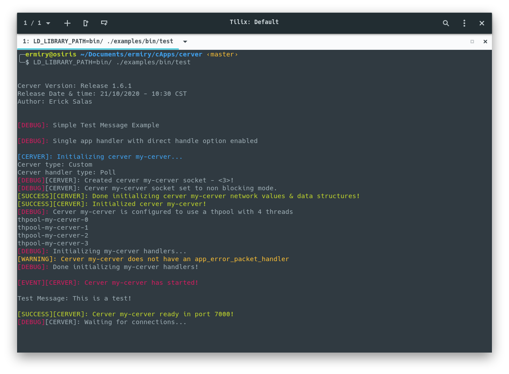
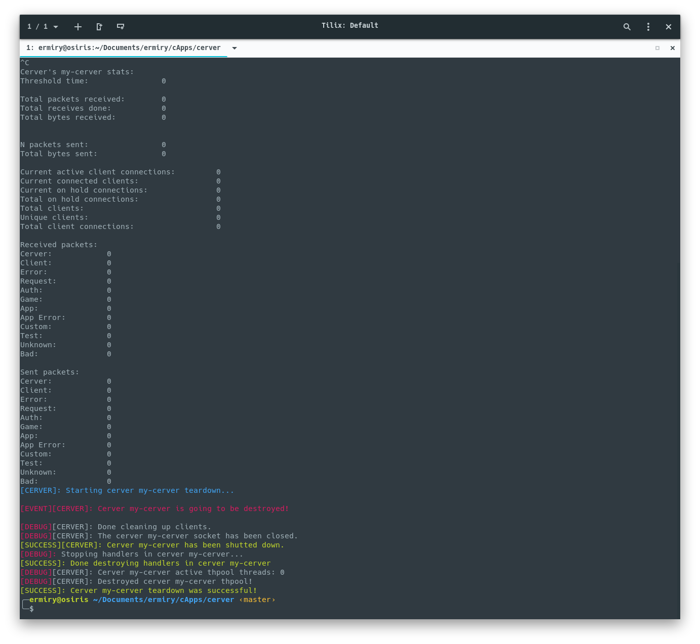

# Get Started

## 1. Install Dependencies

Your first need to install some dependencies to correctly compile **cerver** source code.

### Pthreads

If the pthreads library is not installed on your system, install it (in Ubuntu) by running:

`sudo apt-get install libpthread-stubs0-dev`

## 2. Download Cerver Source Code

You can donwload **cerver's** latest source from this repo. If you want the latest rolling release, you can git clone in the master branch. However if you want the latest stable version, please refer to the releases tab in this repo and select the version you want.

## 3. Get Test Example Running

Now that you have **cerver's** source code, you can try running the base example.

Let's start with a little explanation on the source code layout. You need to focus in two main directories, the src and the include one.

- src -> this is where all the .c source files are located. They are divided into different categories (modules)
- include -> this is where the .h header files are located. They are divided in the same categories with matching names as the ones located in the src directory

Finally there is the examples directory, where you will find some examples to get you started.

We will focus on compiling the test example (test.c). To do this, first we need to compile the cerver library into a shared object (.so). The are three basic commands for the Makefile:

| Command        | Description   |
| -------------  |:-------------:|
| make           | Compile cerver's source code into a shared object (libcerver.so)         |
| make examples  | Compile the examples using the newly created libcerver.so                |
| make install   | Install the newly created libcerver.so & its headers into your system    |
| make clean     | Clean created objects (.o files) and binaries                            |

After a success compilation you can run any of the examples running the following command:

`LD_LIBRARY_PATH=bin/ ./examples/bin/test`

You should see the following ouput in your terminal inidicating that the **cerver** has initialized successfully and is ready to listen for connections:

But you need to add your own configuration and your own application code to correctly handle your custom packets. So for now, we can quit the **cerver** by typing Ctrl + c to send the **cerver** a SIGINT signal, and as we have registered a method to handle that, this is the output that you should see:

## 4. Create Awesome Apps

Now you can start creating your own application's server using **cerver**. Feel free to navigate to the documentation and other tutorials in **cerver.ermiry.com** to get a better understanding on how **cerver** works and how to get the most of it.

Examples are updated constantly and are all open source, you can check them to see the awesome things that can be accomplished.

If you find any bug in **cerver** code, feel free to open a bug ticket explaining the problem and please include any screenshot you think can help or even code that can be used to replicate your issue.

You can also make changes to the source code an open a pull request if you want your code to be part of **cerver**.

Finally, be sure to check the devblog at **cerver.ermiry.com** for any important changes that happen to **cerver**.

Happy coding, 
Erick Salas